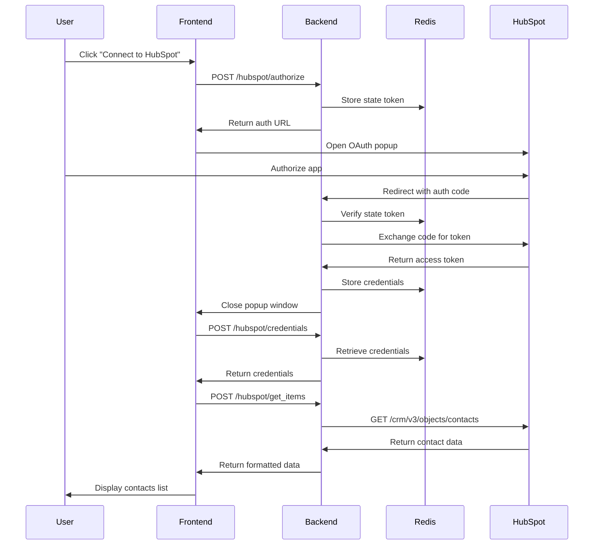
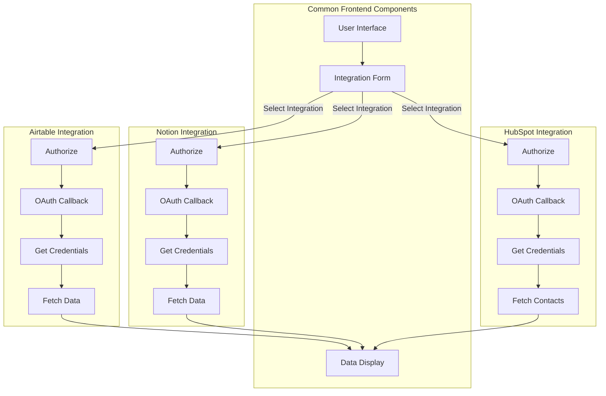
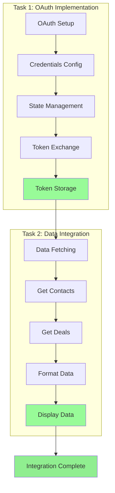

# Integration Technical Assessment

This project implements a full-stack integration platform that allows connecting to various third-party services using OAuth2.0.
## Features

- OAuth2.0 integration with multiple services
- Secure credential management using Redis
- React frontend with Material-UI components
- Modular and extensible architecture

## Supported Integrations

Currently Implemented:
- Notion - Full OAuth2.0 flow and data retrieval
- Airtable - Full OAuth2.0 flow and data retrieval

Planned/In Progress:
- HubSpot - Basic structure added, implementation pending

## Setup Instructions

### Prerequisites

1. Install Redis:
   - Windows:
     ```bash
     # Using WSL (Windows Subsystem for Linux)
     wsl --install
     wsl
     sudo apt-get update
     sudo apt-get install redis-server
     ```
   - macOS:
     ```bash
     brew install redis
     ```
   - Linux:
     ```bash
     sudo apt-get update
     sudo apt-get install redis-server
     ```

2. Start Redis Server:
   - Windows (WSL):
     ```bash
     sudo service redis-server start
     ```
   - macOS/Linux:
     ```bash
     redis-server
     ```
   
   To verify Redis is running:
   ```bash
   redis-cli ping
   ```
   Should return: `PONG`

### Backend

1. Install Python dependencies:
```bash
cd backend
pip install -r requirements.txt
```

2. Start Redis server:
```bash
redis-server
```

3. Start FastAPI server:
```bash
uvicorn main:app --reload
```

### Frontend 

1. Install Node dependencies:
```bash
cd frontend 
npm install
npm start
```

## Usage

1. Access the application at http://localhost:3000
2. Select an integration type from the dropdown
3. Enter user and organization details
4. Click "Connect" to start OAuth flow
5. Authorize the application in the popup window
6. Use "Load Data" to fetch integration data

## API Routes

Backend API endpoints available at http://localhost:8000:

- `POST /integrations/{service}/authorize` - Start OAuth flow
- `GET /integrations/{service}/oauth2callback` - OAuth callback handler
- `POST /integrations/{service}/credentials` - Get stored credentials
- `POST /integrations/{service}/load` - Load integration data

## Environment Variables

Backend:
- `REDIS_HOST` - Redis server hostname (default: localhost)

## Technical Assessment Overview

This technical assessment consists of two main tasks to build a full-stack integration platform:

### Task 1: OAuth2.0 Integration Platform (Current Status)

Currently Implemented:
- ✅ Airtable OAuth2.0 integration with full functionality
- ✅ Notion OAuth2.0 integration with full functionality
- ⏳ HubSpot integration (placeholder only)

Implementation Requirements:
1. Core OAuth2.0 Implementation
   - Complete for Airtable and Notion
   - Pending for HubSpot
   - Implement secure state management and CSRF protection
   - Handle token exchange and storage securely in Redis
   - Support authorization code grant type flow

2. Frontend Development
   - Create responsive React components with Material-UI
   - Build integration selection interface
   - Implement OAuth popup window handling
   - Show real-time connection status
   - Handle errors gracefully

3. Backend Development  
   - Create FastAPI endpoints for OAuth flows
   - Implement secure credential storage in Redis
   - Handle token refresh and expiration
   - Add proper error handling and validation

### Task 2: Data Integration & Display (Current Status)

Currently Implemented:
- ✅ Airtable data retrieval and display
- ✅ Notion data retrieval and display
- ⏳ HubSpot data retrieval (pending)

Implementation Requirements
1. Data Retrieval
   - Fetch data using stored OAuth credentials
   - Transform responses into standardized format
   - Handle rate limits and pagination
   - Implement proper error handling

2. Data Display
   - Show retrieved data in clean UI
   - Support data refresh functionality
   - Add loading states and error messages
   - Allow basic data filtering

#### Expected Deliverables
1. Working OAuth2.0 Implementation
   - Complete authorization flows for Airtable and Notion
   - Secure credential management
   - Clean, documented code

2. Data Integration Features  
   - Data retrieval from both services
   - Standardized data format
   - User-friendly data display
   - Error handling and loading states

3. Documentation
   - Setup instructions
   - API documentation
   - Code comments
   - Architecture overview

## Assignment Tasks

### Task 1: Complete the HubSpot Integration

You need to implement the HubSpot OAuth2.0 integration which includes:

1. Backend Implementation (in `backend/integrations/hubspot.py`):
   - Complete the `authorize_hubspot()` function to initiate OAuth flow
   - Implement `oauth2callback_hubspot()` to handle the OAuth callback
   - Add `get_hubspot_credentials()` to securely store credentials in Redis
   - Implement `get_items_hubspot()` to fetch data from HubSpot API
   - Follow the same pattern used in Airtable and Notion integrations
   - Ensure proper error handling and security measures

2. Frontend Requirements (in `frontend/src/integrations/hubspot.js`):
   - Create the HubSpot integration component
   - Add OAuth popup window handling
   - Implement connection status display
   - Add loading states and error handling
   - Match the UI style of existing integrations

3. Integration Points:
   - Add HubSpot routes to main.py
   - Update IntegrationForm.js to include HubSpot option
   - Follow the existing pattern for credential management
   - Ensure consistent error handling

### Task 2: Enhancements and Testing

1. Testing Requirements:
   - Add unit tests for HubSpot integration
   - Test OAuth flow error cases
   - Verify credential storage security
   - Test data retrieval functionality
   - Validate error handling

2. Security Considerations:
   - Implement secure state management
   - Add CSRF protection
   - Secure credential storage
   - Handle token expiration
   - Follow OAuth2.0 best practices

3. Documentation:
   - Add HubSpot API documentation
   - Update setup instructions
   - Document environment variables
   - Include testing procedures
   - Add error handling documentation

Your task is to extend the existing integration platform by adding HubSpot as a new integration while maintaining the same level of security, error handling, and user experience as the existing Airtable and Notion integrations.

For HubSpot integration, you'll need:
- HubSpot Developer Account
- OAuth2.0 Application Credentials
- API Documentation Reference
- Testing Environment

Follow the existing patterns in the codebase for consistency and maintainability.

# Task 1: HubSpot Integration Implementation

This document outlines the implementation of the HubSpot integration following the same pattern as existing Airtable and Notion integrations.

## Setup and Configuration

### Environment Variables
```env
HUBSPOT_CLIENT_ID=your_client_id
HUBSPOT_CLIENT_SECRET=your_client_secret
HUBSPOT_REDIRECT_URI=http://localhost:8000/integrations/hubspot/oauth2callback
```

### Files Modified/Created

1. `backend/integrations/hubspot.py` - Core HubSpot integration logic
2. `frontend/src/integrations/hubspot.js` - Frontend React component
3. `backend/main.py` - Added HubSpot API endpoints
4. `.env` - Added HubSpot credentials

## Implementation Details

### Backend Implementation (hubspot.py)

1. **OAuth Flow**
   - `authorize_hubspot()`: Initiates OAuth flow
   - `oauth2callback_hubspot()`: Handles callback with state validation
   - Uses Redis for state management and security

2. **Data Management**
   - `get_hubspot_credentials()`: Manages credential storage/retrieval
   - `create_integration_item_metadata_object()`: Creates standardized metadata
   - `get_items_hubspot()`: Fetches contact data

### Frontend Implementation (hubspot.js)

1. **React Component**
   - OAuth popup window management
   - Connection state handling
   - Error handling and user feedback

### API Endpoints (main.py)

```python
@app.post('/integrations/hubspot/authorize')
@app.get('/integrations/hubspot/oauth2callback')
@app.post('/integrations/hubspot/credentials')
@app.post('/integrations/hubspot/get_hubspot_items')
```

## Security Features

1. State parameter validation
2. Redis temporary storage
3. Environment variables for secrets
4. CORS configuration
5. Token handling
6. Error handling

## Data Flow

1. Frontend initiates connection
2. Backend generates auth URL with state
3. User authorizes in popup
4. HubSpot redirects to callback
5. Backend validates and exchanges code
6. Frontend receives success

## Integration Features

1. Contact data access
2. Standardized metadata format
3. Error handling
4. Cross-browser support
5. Secure credential management

## Testing

1. Run backend: `uvicorn main:app --reload`
2. Run frontend: `npm start`
3. Test OAuth flow:
   - Click "Connect to HubSpot"
   - Authorize application
   - Verify connection status
   - Test data retrieval

## Common Issues and Solutions

1. State Mismatch
   - Ensure proper state encoding/decoding
   - Check Redis connection
   - Verify state parameter passing

2. Network Errors
   - Check CORS settings
   - Verify credentials
   - Ensure proper scopes

3. Browser Issues
   - Allow popups
   - Check console for errors
   - Clear cache if needed

## HubSpot Integration Workflow



### Simple Explanation of the Flow:
1. **Connection Start**
   - User clicks "Connect to HubSpot" button
   - Frontend asks backend for authorization URL
   - Backend creates a security token and stores it in Redis
   - Frontend opens a popup window with HubSpot login

2. **Authorization Process**
   - User logs into HubSpot and approves the app
   - HubSpot sends an authorization code back
   - Backend verifies everything is secure
   - Backend gets access token from HubSpot
   - Token is safely stored in Redis

3. **Data Loading**
   - Frontend requests stored credentials
   - Backend gets credentials from Redis
   - Frontend asks for HubSpot data
   - Backend fetches contacts from HubSpot
   - Data is shown to user in the interface

## Integration Workflows



### Simple Explanation of Each Integration:
1. **Common Parts for All**
   - Same user interface for everyone
   - One form to select which service to use
   - Same display area for all data

2. **How Each Integration Works**
   - **Airtable Flow**:
     * Connect to Airtable
     * Get permission
     * Get login details
     * Load tables and data

   - **Notion Flow**:
     * Connect to Notion
     * Get permission
     * Get login details
     * Load pages and content

   - **HubSpot Flow**:
     * Connect to HubSpot
     * Get permission
     * Get login details
     * Load contacts and deals

3. **End Result**
   - All data shows up in the same format
   - User sees a consistent interface
   - Easy to switch between services

### Integration Flow Comparison

1. **Frontend Layer**
   - Common user interface for all integrations
   - Integration selection form
   - Unified data display component

2. **OAuth Flow (All Integrations)**
   - Authorization initiation
   - OAuth callback handling
   - Credential management
   - State validation

3. **Data Retrieval**
   - Airtable: Bases and tables
   - Notion: Pages and blocks
   - HubSpot: Contacts and properties

4. **Security Features**
   - Redis state management
   - CORS protection
   - Secure token storage
   - Error handling

### Key Differences

| Feature | Airtable | Notion | HubSpot |
|---------|----------|---------|----------|
| Auth Method | PKCE Flow | Basic OAuth | OAuth 2.0 |
| Data Type | Tables | Pages | Contacts |
| Scopes | Base Access | Content R/W | CRM Objects |
| Token Storage | Redis | Redis | Redis |

## Task Status & Implementation

### Task 1: HubSpot OAuth2.0 Integration ✅
Implemented HubSpot OAuth flow and authorization with:
- Secure credential storage and state management
- OAuth popup window handling
- Token exchange and callback handling

Files Modified:
- `/backend/integrations/hubspot.py` - Core OAuth implementation
- `/frontend/src/integrations/hubspot.js` - Frontend OAuth flow
- `/backend/main.py` - Added HubSpot endpoints
- `/backend/.env` - Added HubSpot credentials

### Task 2: HubSpot Data Integration ✅
Implemented data retrieval and display with:
- Contacts and deals fetching
- Standardized data format
- Console and UI display
- Error handling

Files Modified:
- `/backend/integrations/hubspot.py` - Added data fetching
- `/frontend/src/data-form.js` - Updated data display
- `/frontend/src/integration-form.js` - Added HubSpot support

Both tasks are now complete with working OAuth flow, data retrieval, and display functionality.

## Implementation Workflow



Both tasks have been successfully completed with:
1. Working OAuth2.0 flow
2. Secure credential management
3. Data retrieval and display
4. Error handling and user feedback
5. Console verification of retrieved data


