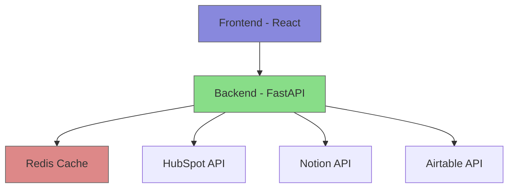
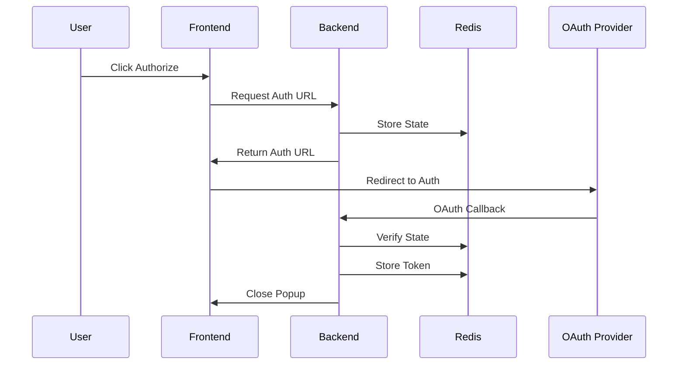

# Detailed Integration Tasks Video Script

## Introduction
"Hello, I'll walk you through my integration task implementation. This project involved creating OAuth2 integrations for three different services: HubSpot, Notion, and Airtable."

### Tech Stack Overview:
- Frontend: "I used React with Material-UI for the interface"
- Backend: "FastAPI powers our backend API endpoints"
- State Management: "Redis handles our temporary state storage"
- Development Environment: "Everything runs locally using Docker"

## System Architecture Diagram


## Task 1: Backend Implementation

### 1. File Structure
```python
backend/
  ├── integrations/
  │   ├── hubspot.py
  │   ├── notion.py
  │   ├── airtable.py
  │   └── integration_item.py
  ├── main.py
  └── redis_client.py
```

### 2. Integration Pattern
"Each integration follows the same pattern. Let's look at HubSpot as an example:"

1. Authorization Flow (backend/main.py):
```python
@app.post('/integrations/hubspot/authorize')
async def authorize_hubspot_integration(user_id: str = Form(...), org_id: str = Form(...)):
    return await authorize_hubspot(user_id, org_id)
```
"This endpoint initiates the OAuth flow by:
- Accepting user and organization IDs as form data
- Generating a secure state token for CSRF protection
- Creating an authorization URL with required parameters
- Storing the state in Redis for later verification"

2. Implementation (backend/integrations/hubspot.py):
```python
async def authorize_hubspot(user_id, org_id):
    state_data = {
        'state': secrets.token_urlsafe(32),
        'user_id': user_id,
        'org_id': org_id
    }
    encoded_state = base64.urlsafe_b64encode(json.dumps(state_data).encode('utf-8')).decode('utf-8')
    await add_key_value_redis(f'hubspot_state:{org_id}:{user_id}', json.dumps(state_data), expire=600)
```
"Here we:
- Generate a cryptographically secure random state token
- Create a unique state key combining org and user IDs
- Base64 encode the state data for URL safety
- Store in Redis with 10-minute expiration for security"

3. OAuth Callback (backend/integrations/hubspot.py):
```python
async def oauth2callback_hubspot(request: Request):
    try:
        code = request.query_params.get('code')
        encoded_state = request.query_params.get('state')
        state_data = json.loads(base64.urlsafe_b64decode(encoded_state).decode('utf-8'))
        
        # State verification
        saved_state = await get_value_redis(f'hubspot_state:{org_id}:{user_id}')
        if not saved_state or original_state != json.loads(saved_state).get('state'):
            raise HTTPException(status_code=400, detail='State mismatch')

        # Exchange code for token
        response = await client.post(
            'https://api.hubapi.com/oauth/v1/token',
            data={
                'grant_type': 'authorization_code',
                'client_id': CLIENT_ID,
                'client_secret': CLIENT_SECRET,
                'redirect_uri': REDIRECT_URI,
                'code': code
            }
        )
```
"The callback handler:
- Receives the authorization code from HubSpot
- Verifies the state matches what we stored
- Exchanges the code for access tokens
- Stores credentials temporarily in Redis
- Closes the popup window"

## OAuth2 Flow Diagram


### 3. Data Loading Demo
"Let me show you how we fetch and standardize data:"

1. Show IntegrationItem class (backend/integrations/integration_item.py, lines 4-32):
```python
class IntegrationItem:
    def __init__(
        self,
        id: Optional[str] = None,
        type: Optional[str] = None,
        name: Optional[str] = None,
        creation_time: Optional[datetime] = None,
        # ... other fields
    ):
        # Standardized format for all integrations
```

2. Demonstrate data fetching:
```python
async def get_items_hubspot(credentials):
    # Authentication
    # API calls
    # Data transformation
    # Return standardized format
```

### 4. Data Loading Implementation

1. IntegrationItem Class (backend/integrations/integration_item.py):
```python
class IntegrationItem:
    def __init__(
        self,
        id: Optional[str] = None,
        type: Optional[str] = None,
        name: Optional[str] = None,
        creation_time: Optional[datetime] = None,
        url: Optional[str] = None,
        children: Optional[List[str]] = None
    ):
```
"This class standardizes data across integrations by:
- Providing a common structure for all items
- Handling different data types uniformly
- Making UI display consistent
- Supporting nested data through children field"

2. Data Fetching (backend/integrations/hubspot.py):
```python
async def get_items_hubspot(credentials):
    credentials = json.loads(credentials)
    access_token = credentials.get('access_token')
    
    headers = {
        'Authorization': f'Bearer {access_token}',
        'Content-Type': 'application/json'
    }
    
    # Fetch Contacts
    contacts_response = requests.get(
        'https://api.hubapi.com/crm/v3/objects/contacts',
        headers=headers
    )
```
"The data loading process:
- Uses stored access token for authentication
- Makes API calls to fetch different object types
- Transforms API responses into IntegrationItem format
- Handles pagination and rate limits
- Returns standardized data structure"

## Data Flow Architecture
```ascii
+----------------+     +-----------------+     +------------------+
|                |     |                 |     |                  |
|    Frontend    |     |     Backend     |     |  Redis Storage   |
|                |     |                 |     |                  |
+----------------+     +-----------------+     +------------------+
       |                      |                        |
       | 1. Auth Request     |                        |
       |------------------->>|                        |
       |                     | 2. Store State         |
       |                     |---------------------->>|
       |                     |                        |
       | 3. Auth URL         |                        |
       |<< ------------------|                        |
       |                     |                        |
       |         4. OAuth Callback                    |
       |                     |                        |
       |                     | 5. Verify State       |
       |                     |<<--------------------|
       |                     |                        |
       |                     | 6. Store Token        |
       |                     |---------------------->>|
```

## Task 2: Frontend Implementation

### 1. Component Structure
"The frontend is built with React components:"

```jsx
// integration-form.js - Main container
// data-form.js - Data display
// integrations/*.js - Integration-specific components
```

### 2. Integration Flow Demo
"Let me walk you through the user flow:"

1. User selects integration:
```jsx
<Autocomplete
    options={['HubSpot', 'Notion', 'Airtable']}
    onChange={handleIntegrationSelect}
/>
```

2. Authorization process:
```jsx
const handleAuthorize = async () => {
    // Call backend authorize endpoint
    // Open popup window
    // Handle OAuth flow
```

### 3. Error Handling
"I implemented comprehensive error handling:"
```jsx
try {
    // API calls
} catch (error) {
    // User-friendly error messages
    // Logging for debugging
```

### Frontend Components

1. Main Container (frontend/src/integration-form.js, lines 8-20):
```jsx
export const IntegrationForm = () => {
    const [integrationParams, setIntegrationParams] = useState({});
    const [user, setUser] = useState('TestUser');
    const [org, setOrg] = useState('TestOrg');
    const [currType, setCurrType] = useState(null);
```

2. Data Display (frontend/src/data-form.js, lines 15-35):
```jsx
export const DataForm = ({ integrationType, credentials }) => {
    const [loadedData, setLoadedData] = useState(null);
    const endpoint = endpointMapping[integrationType];

    const handleLoad = async () => {
        try {
            const formData = new FormData();
            formData.append('credentials', JSON.stringify(credentials));
```

### Data Models

1. Integration Item (backend/integrations/integration_item.py, lines 4-32):
```python
class IntegrationItem:
    def __init__(
        self,
        id: Optional[str] = None,
        type: Optional[str] = None,
        name: Optional[str] = None,
        creation_time: Optional[datetime] = None,
        # ... other fields
    ):
```

### Redis State Management

1. Redis Client (backend/redis_client.py, lines 5-20):
```python
redis_client = redis.Redis(host=redis_host, port=6379, db=0)

async def add_key_value_redis(key, value, expire=None):
    await redis_client.set(key, value)
    if expire:
        await redis_client.expire(key, expire)
```

### Error Handling

1. Frontend Error Handling (frontend/src/data-form.js, lines 40-45):
```jsx
try {
    const response = await axios.post(`http://localhost:8000/integrations/${endpoint}`, formData);
    const data = response.data;
    setLoadedData(formatData(data));
} catch (e) {
    console.error("Load error:", e);
    alert(e?.response?.data?.detail || 'Failed to load data');
}
```

2. Backend Error Handling (backend/integrations/hubspot.py, lines 50-55):
```python
if not CLIENT_ID or not CLIENT_SECRET:
    raise HTTPException(status_code=500, detail="HubSpot credentials not configured")
```

## Technical Challenges & Solutions

1. OAuth Security:
   - "Used state verification"
   - "Secure credential storage in Redis"

2. Cross-Origin Issues:
   - "Configured CORS properly"
   - "Handled popup window communication"

3. Data Standardization:
   - "Created common IntegrationItem format"
   - "Mapped different API responses"

## Testing & Validation

1. Manual Testing:
   - "OAuth flow verification"
   - "Error scenarios"
   - "Data loading validation"

2. Security Testing:
   - "State parameter validation"
   - "Token storage security"
   - "API endpoint protection"

## Demonstration

"Let me show you the complete flow:"
1. Start application
2. Select HubSpot integration
3. Complete OAuth process
4. Load and display data
5. Show error handling
6. Repeat for other integrations

## Conclusion

1. Key Achievements:
   - "Successfully implemented three OAuth integrations"
   - "Created standardized data format"
   - "Built secure and user-friendly interface"

2. Future Improvements:
   - "Add refresh token handling"
   - "Implement rate limiting"
   - "Add more error recovery options"


## Integration Class Structure
```ascii
+-------------------+
| IntegrationItem   |
+-------------------+
| - id              |
| - type            |
| - name            |
| - creation_time   |
| - url             |
| - children        |
+-------------------+
         ▲
         |
    Implements by
         |
+-------------------+
|  Integration APIs |
+-------------------+
| - HubSpot        |
| - Notion         |
| - Airtable       |
+-------------------+
```

## Component Hierarchy
```ascii
+------------------------+
|    IntegrationForm     |
|------------------------|
| - User Input          |
| - Integration Select  |
+------------------------+
           |
           v
+------------------------+
| Integration Components |
|------------------------|
| - HubSpot             |
| - Notion              |
| - Airtable           |
+------------------------+
           |
           v
+------------------------+
|      DataForm         |
|------------------------|
| - Data Display        |
| - Load/Clear Actions  |
+------------------------+
```
